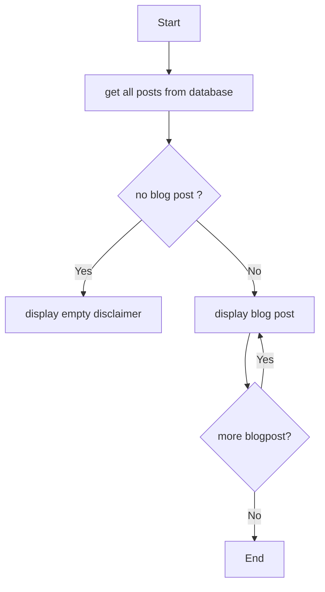
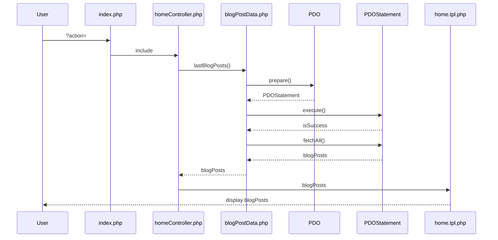
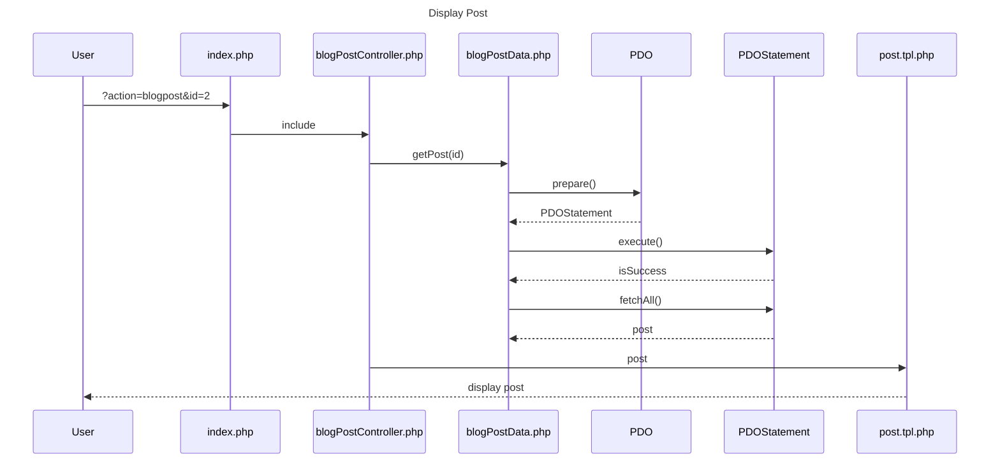

```mermaid
graph TD
;
    A[Start] --> B[get all posts from database]
    B --> C{no blog post ?}
    C -- Yes --> D[display empty disclaimer]
    C -- No --> E[display blog post]
    E --> F{more blogpost?}
    F -- Yes --> E
    F -- No --> G[End]
```

```mermaid
sequenceDiagram
;
    User ->> index.php: ?action=
    index.php ->> homeController.php: include
    homeController.php ->> blogPostData.php: lastBlogPosts()
    blogPostData.php ->> PDO: prepare()
    PDO -->> blogPostData.php: PDOStatement
    blogPostData.php ->> PDOStatement: execute()
    PDOStatement -->> blogPostData.php: isSuccess
    blogPostData.php ->> PDOStatement: fetchAll()
    PDOStatement -->> blogPostData.php: blogPosts
    blogPostData.php -->> homeController.php: blogPosts
    homeController.php ->> home.tpl.php: blogPosts
    home.tpl.php -->> User: display blogPosts
```

```mermaid
sequenceDiagram 
;
    title Display Post
    
    User ->> index.php: ?action=blogpost&id=2
    index.php ->> blogPostController.php: include
    blogPostController.php ->> blogPostData.php: getPost(id)
    blogPostData.php ->> PDO: prepare()
    PDO -->> blogPostData.php: PDOStatement
    blogPostData.php ->> PDOStatement: execute()
    PDOStatement -->> blogPostData.php: isSuccess
    blogPostData.php ->> PDOStatement: fetchAll()
    PDOStatement -->> blogPostData.php : post
    blogPostController.php ->> post.tpl.php: post
    post.tpl.php -->> User: display post
```